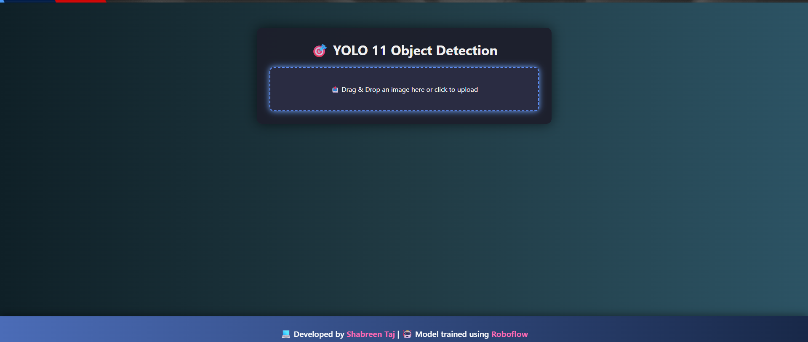
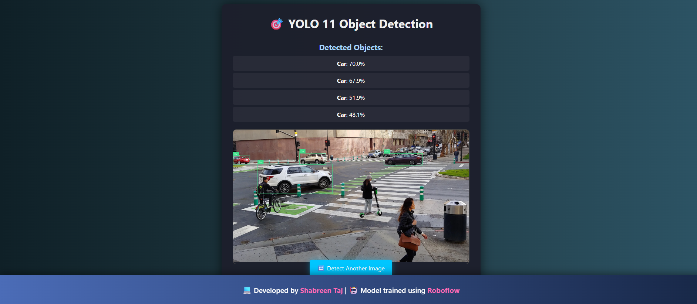
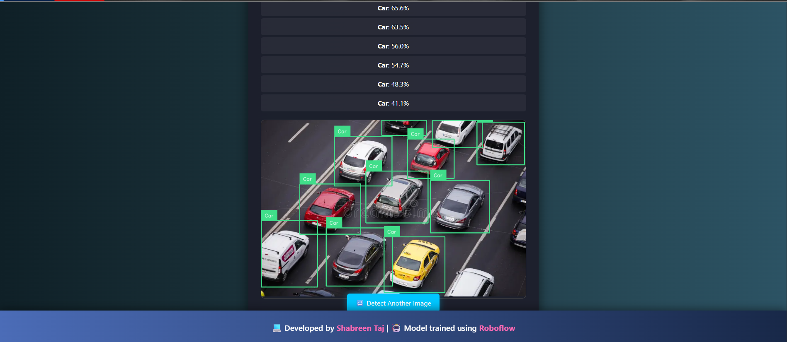
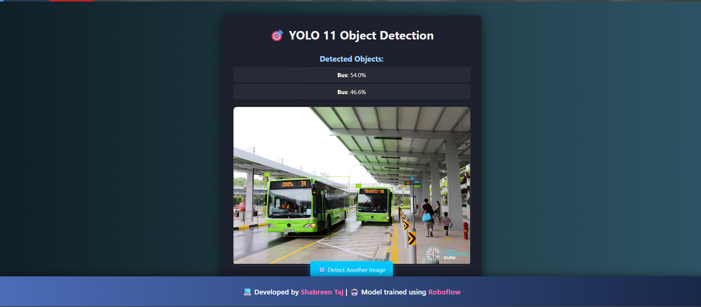
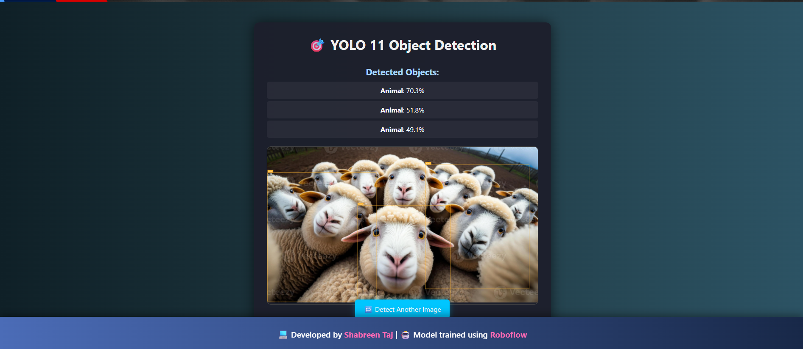
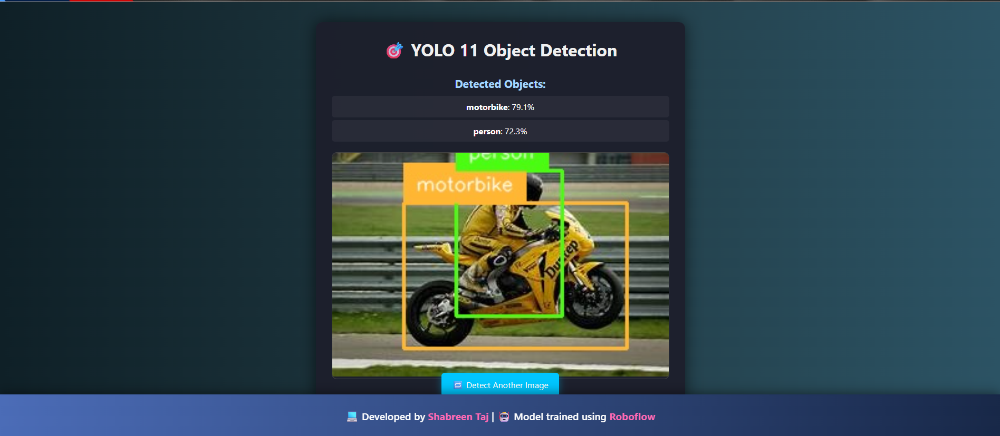
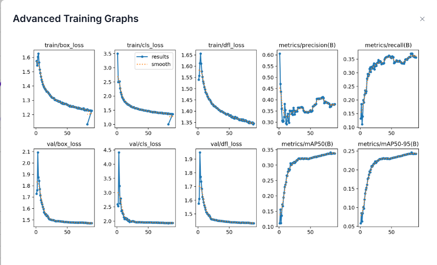

# 🎯 YOLOv11 Multi-Class Object Detection – Web Application


---

## 🌐 About the Project

This is a **YOLOv11-powered multi-class object detection web interface**, built using **Flask** and styled for a sleek, interactive user experience.

The object detection model was **trained using Roboflow's hosted training pipeline** using images combined from various public Universe projects.  

---

## ⚡ Live UI Demo

### 🖥️ Web Interface


### 🚗 Vehicle Detection




### 🐾 Animal & Person Detection



---

## 📊 Model Performance

### Training Graphs


### Advanced Metrics


> **Model Type**: YOLOv11 (Fast)  
> **mAP@50**: 34.1% | **Precision**: 37.5% | **Recall**: 37.1%  
> **Trained Images**: 37,647  
> **Epochs**: 90  

---

## 📁 Dataset & Augmentations

### Split Summary

| Split      | %   | Images |
|------------|-----|--------|
| Train      | 89% | 33,390 |
| Validation | 8%  | 3,059  |
| Test       | 3%  | 1,198  |

### Preprocessing & Augmentations

- ✅ Auto-Orient  
- 📐 Resize to 640x640  
- ⚙️ Adaptive Equalization  
- 🔄 Horizontal Flip  
- 🔄 Rotation ±15°  
- ✂️ Shear ±5%  
- 🎨 Hue ±10%  
- 🌓 Saturation ±5%  
- 🌞 Brightness ±10%  
- 📷 Exposure ±5%  
- 🌀 Blur (up to 1px)  
- ⚡ Noise (up to 0.54%)  

---

## ⚙️ Technologies Used

- 🧠 **YOLOv11** model  
- 🔬 Roboflow training  
- 🎯 Flask for Web Interface  
- 🖼️ OpenCV for image handling  
- 🧠 Supervision for annotation overlay  
- 💅 HTML, CSS, JS for frontend  

## 🔐 API & Access Instructions

> 🧠 **Note:** This project uses a YOLOv11 model hosted on [Roboflow](https://roboflow.com).  
> Users must use their **own API key** to access the model.

### ⚙️ How to Get Started

1. **Create a free Roboflow account** → [https://roboflow.com](https://roboflow.com)
2. **Go to your workspace** and generate a **Private API Key**
3. **Create a `.env` file** in your project directory and add your API key:
```
ROBOFLOW_API_KEY=your_private_api_key_here
```
## ⚙️ Installation & Running the App

### 📁 Clone the Repository

```bash
git clone https://github.com/taj-shabreen/YOLOv11-MultiClass-Detection-Web.git
cd YOLOv11-MultiClass-Detection-Web
```
📦 Install Dependencies
Make sure you have Python 3.7+ installed. Then install the required libraries using:
```
pip install -r requirements.txt
```
🔐 Set Up API Key

🚀 Run the App
Launch the web app locally:
```
python app.py
```
Then open your browser and go to:
```
http://127.0.0.1:5000
```
You'll be able to:

Drag & drop an image

Detect multiple object classes

View results with confidence scores and annotated image

## ✨ Features
✅ Clean drag-and-drop or upload interface

🎯 Real-time visual predictions

📋 Object name + confidence

📱 Mobile-responsive

🚫 Graceful error when no objects detected

💾 Result image saved locally

## 🧪 Try the Trained Model / Download Dataset
---

<a href="https://universe.roboflow.com/objectdetectionlab-9hw4e/multi-class-object-detection-qjnaq/model/">
  
</a>
<a href="https://universe.roboflow.com/objectdetectionlab-9hw4e/multi-class-object-detection-qjnaq">
  
</a>

---

## 👩‍💻 Developed By

<p align="center">
  
</p>

<p align="center">
  <a href="https://github.com/taj-shabreen" target="_blank">
    
  </a>
</p>

## 🌟 Contribute or Star
 If you liked the project, give it a star⭐️
