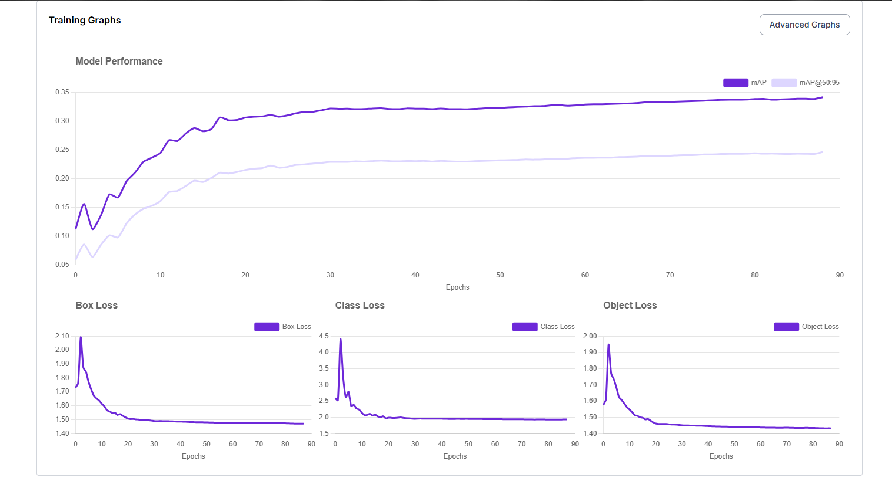

# 🎯 YOLOv11 Multi-Class Object Detection – Web Application


---

## 🌐 About the Project

This is a **YOLOv11-powered multi-class object detection web interface**, built using **Flask** and styled for a sleek, interactive user experience.

The object detection model was **trained using Roboflow's hosted training pipeline** using images combined from various public Universe projects.  
The complete frontend & backend is **developed by Shabreen Taj**.

---

## ⚡ Live UI Demo

### 🖥️ Web Interface


### 🚗 Vehicle Detection


### 🐾 Animal & Person Detection


---

## 📊 Model Performance

### Training Graphs


### Advanced Metrics


> **Model Type**: YOLOv11 (Fast)  
> **mAP@50**: 34.1% | **Precision**: 37.5% | **Recall**: 37.1%  
> **Trained Images**: 37,647  
> **Epochs**: 90  

---

## 📁 Dataset & Augmentations

### Split Summary

| Split      | %   | Images |
|------------|-----|--------|
| Train      | 89% | 33,390 |
| Validation | 8%  | 3,059  |
| Test       | 3%  | 1,198  |

### Preprocessing & Augmentations

- ✅ Auto-Orient  
- 📐 Resize to 640x640  
- ⚙️ Adaptive Equalization  
- 🔄 Horizontal Flip  
- 🔄 Rotation ±15°  
- ✂️ Shear ±5%  
- 🎨 Hue ±10%  
- 🌓 Saturation ±5%  
- 🌞 Brightness ±10%  
- 📷 Exposure ±5%  
- 🌀 Blur (up to 1px)  
- ⚡ Noise (up to 0.54%)  

---

## ⚙️ Technologies Used

- 🧠 **YOLOv11** model  
- 🔬 Roboflow training  
- 🎯 Flask for Web Interface  
- 🖼️ OpenCV for image handling  
- 🧠 Supervision for annotation overlay  
- 💅 HTML, CSS, JS for frontend  

---

<a href="https://universe.roboflow.com/objectdetectionlab-9hw4e/multi-class-object-detection-qjnaq/model/">
  
</a>
<a href="https://universe.roboflow.com/objectdetectionlab-9hw4e/multi-class-object-detection-qjnaq">
  
</a>

---

## 🚀 How to Run Locally

```bash
git clone https://github.com/taj-shabreen/YOLOv11-MultiClass-Detection-Web.git

cd YOLOv11-MultiClass-Detection-Web

python -m venv .venv

.venv\Scripts\activate  # or source .venv/bin/activate

pip install -r requirements.txt
```
📄 Create .env file
```
ROBOFLOW_API_KEY=your_private_api_key_here
```
## 🔐 API & Access Instructions

🔐 Your workspace and API key remain secure

🗝️ Model access requires user's own Roboflow API key

🧠 Others cannot modify your model or use your credits

✅ Safe for GitHub public usage (if .env is ignored)

## ✨ Features
✅ Clean drag-and-drop or upload interface

🎯 Real-time visual predictions

📋 Object name + confidence

📱 Mobile-responsive

🚫 Graceful error when no objects detected

💾 Result image saved locally

## 👩‍💻 Developed By

<p align="center">
  
</p>

<p align="center">
  <a href="https://github.com/taj-shabreen" target="_blank">
    🔗 github.com/taj-shabreen
  </a>
</p>

## 🌟 Contribute or Star
⭐️ If you liked the project, give it a star!
